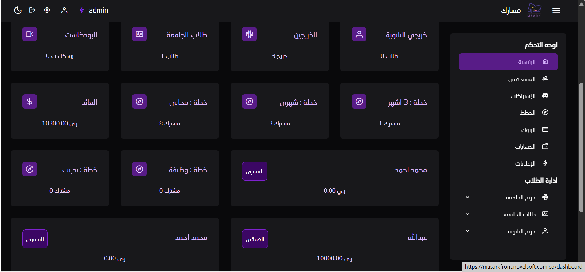
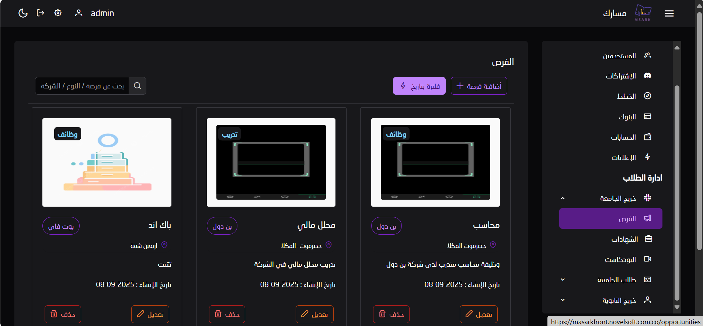
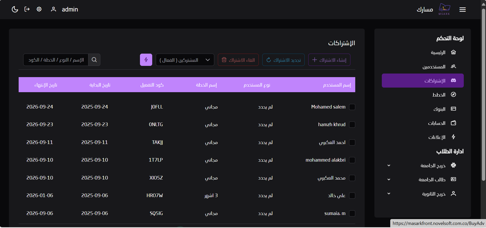
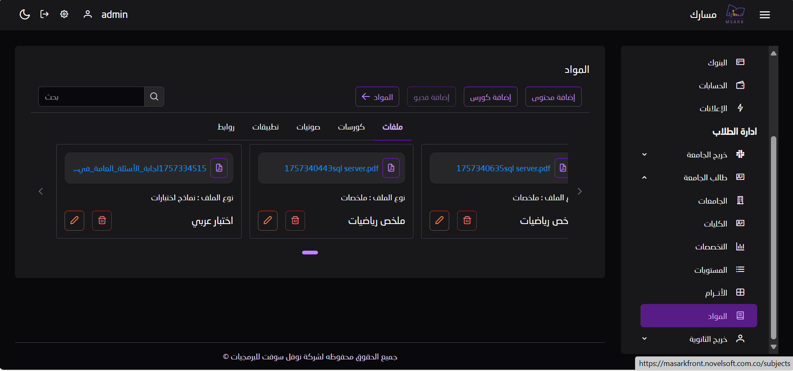

# 🎓 Masark Platform

## 🧩 About the Project
A complete web and mobile platform for managing educational content, study plans, and subscriptions — designed for **high school students, university students, and graduates**.

The system supports academic and professional development through interactive content, structured programs, and integrated progress tracking.

---

## 🎯 Goals
- Manage users, study plans, and subscriptions.
- Organize universities, colleges, majors, and study levels.
- Manage educational courses, videos, podcasts, and materials.
- Manage job opportunities, career development, and resumes.
- Provide analytical reports about learning progress and user activity.

---

## 👥 Main Roles

### 🧑‍💼 Admin (Web Dashboard)
- Manage users and subscriptions.
- Control study plans, courses, and universities.
- Manage educational content (videos, podcasts, materials).
- Manage payments, ads, and platform settings.
- Access detailed usage and performance reports.

### 🎓 Student (Mobile App)
- Register and manage personal profile.
- Access and subscribe to study plans.
- Watch videos, listen to podcasts, and download materials.
- Explore universities, majors, and courses.
- View job opportunities and manage preferences & notifications.

---

## 🚀 Outputs
- **Web Dashboard** for administrators and content managers.
- **Mobile App** for students and graduates.
- **Analytics System** for progress and performance insights.

---

## 🖼️ Screenshots
| Web Dashboard 
| 
| 
| 
| 

---

## 🛠️ Tech Stack
- **Backend:** Laravel (RESTful API)
- **Frontend:** React / Next.js
- **Mobile App:** Flutter
- **Database:** MySQL / PostgreSQL
- **Version Control:** Git + GitHub

